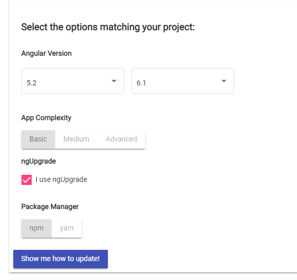
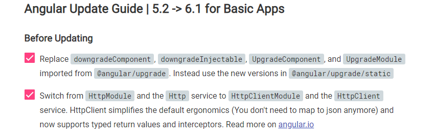
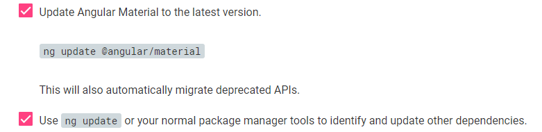
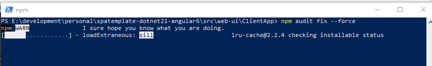
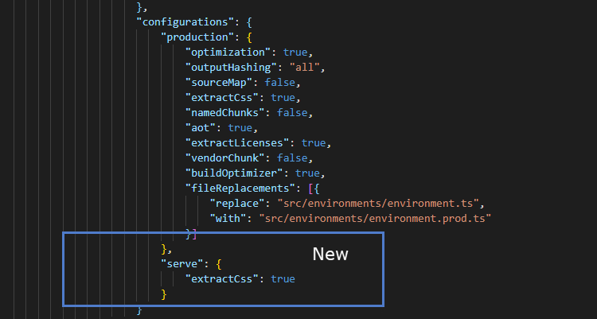
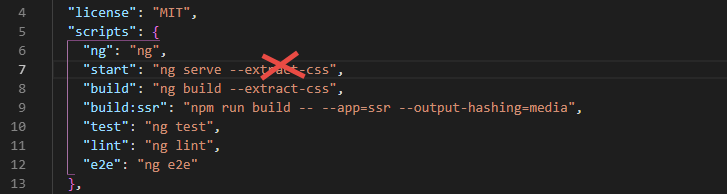
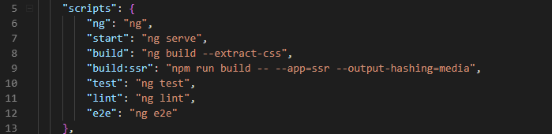
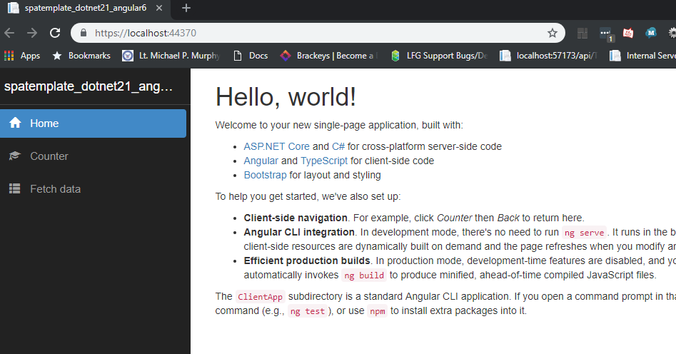

# Microsoft Angular SpaTemplate Upgrade to Angular 6

Even if you're using the latest Angular SpaTemplate (as of Sept. 18, 2018) from dot net core 2.1, you'll only get Angular 5.2. Upgrading to 6 takes a fair amount of work and research due mostly to rxjs, infrastructure, and build changes Angular decided to push into Angular 6. Here is the definitive guide on how to perform that upgrade.

## Step 1 - Update Angular



follow the guide on [update.angular.io](http://update.angular.io). Choose 5.2 => 6.X and follow the instructions. Not all of them will mean anything if you are using the base SpaTemplate, but they're a decent enough baseline.

For example, if you are using the base SpaTemplate, none of the "Before Updating" steps are relevant. The template already uses HttpClient.



Most of "During Update" is relevant, except there is no material installed, and there are a few extra steps.

Before the final ```ng update``` or ```ng update --all``` you will need to update a couple things not covered in the guide.



1. Typescript at the global level needs to be updated. ```ng i -g typescript@2.9.2``` The rxjs-5-to-migrate command will fail without it.
2. Module-map-ngfactory-loader needs to be manually updated, you'll see the wrong nguniversal command in the powershell. Here is the proper command ```ng update @nguniversal/module-map-ngfactory-loader```
3. After ```ng update --all``` run ```npm install``` for good measure

Go ahead and follow "After the Update", but the base template really doesn't use much of rxjs.

## Step 1a - Optional Updates

You'll see a bunch of issues on the command line around security fixes. go ahead and run an ```npm audit fix --force```. They have a sense of humor, you'll get this nice message.



## Step 2 - Build Changes

extract-css is no longer a valid parameter to ng serve on the command line. you can back-door it through the angular.json.



add the command to the "serve" portion of "configuration.



to the following (without extract-css):



Voila! now it will build and run from VS.NET.

